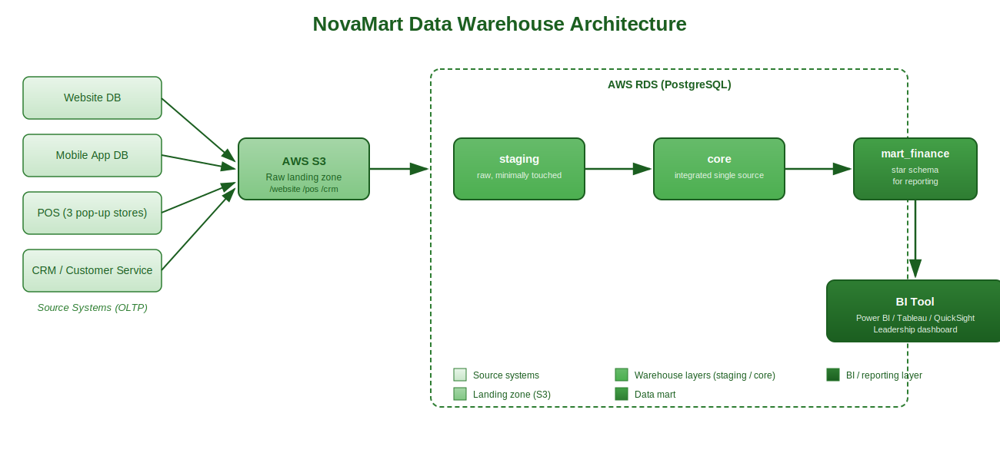
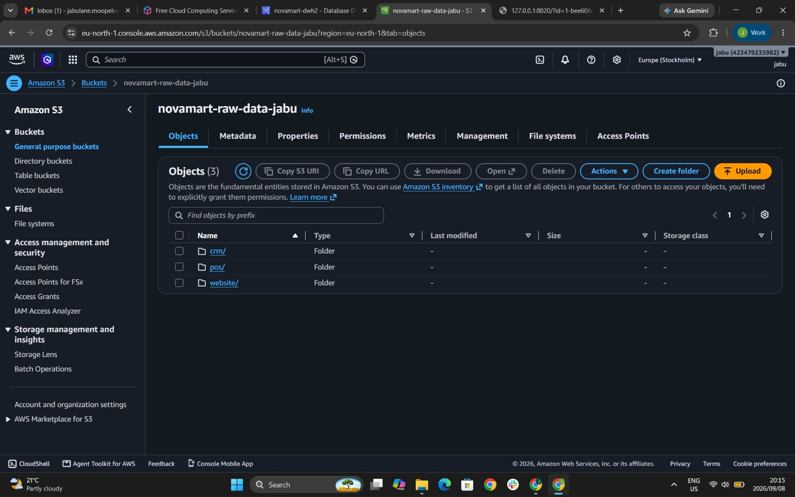
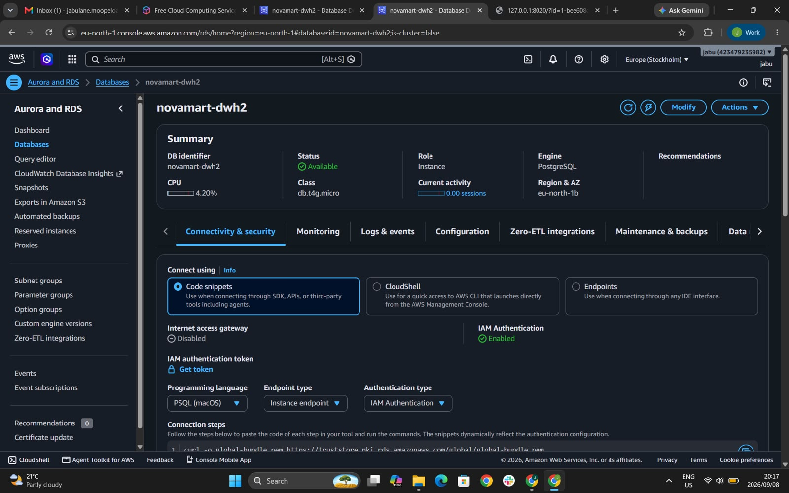
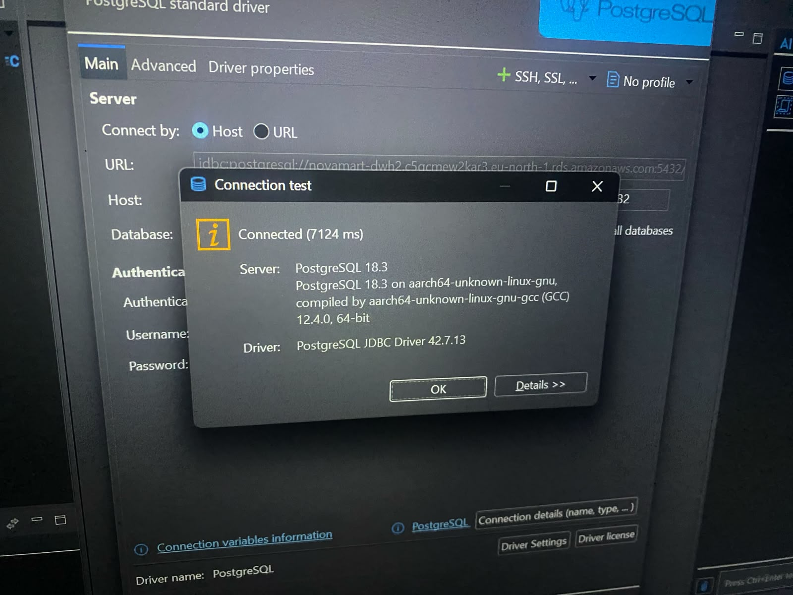
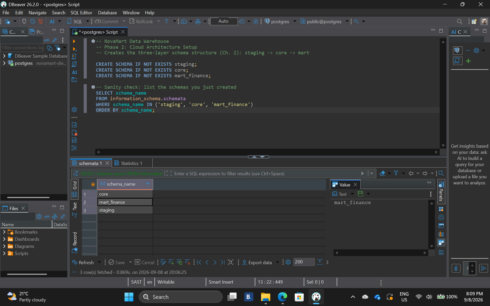

# Business Requirements — NovaMart Sales Data Warehouse

## Team Members
- Moopeloa Jabulane — 22350028
- Asande Akhona Dlamini — 22367136
- Sibahle Magubane — 22271233
- Senamile Nxumalo — 22302052

## 1. What Business Process Will It Support?
**Chosen process: Sales.**

Following Ch. 4 Step 1 (pick the most critical, most available/reliable process), Sales is the
recommended starting point because:
- It's the process leadership explicitly complained about ("nobody can tell us which products
  are profitable, which channel is growing").
- Transaction-level sales data is available and reliable across all three channels
  (website, app, pop-up stores) in our chosen dataset.
- It's the foundation other processes (fulfilment, marketing attribution) will eventually build on.

## 2. Five Business Questions
1. Which products are most profitable, by region?
2. How long does order fulfilment take, on average, and where are the bottlenecks?
3. What is month-to-date revenue by channel (website, app, pop-up store)?
4. Which channel is growing fastest year-over-year?
5. What is the average order value by customer segment?

## 3. Architecture Diagram

Sources (Website DB, Mobile App DB, POS, CRM) → AWS S3 (raw landing) → RDS PostgreSQL
`staging` schema → `core` schema → `mart_finance` schema → BI tool.

## 4. OLTP vs. OLAP Classification (Ch. 1 §2.3)
| Question | Type | Why |
|---|---|---|
| Which products are most profitable, by region? | OLAP | Aggregates across many orders/products; analytical, not a single-transaction lookup |
| How long does order fulfilment take? | OLAP | Requires aggregating timestamps across many orders |
| Month-to-date revenue by channel? | OLAP | Time-based aggregate query across the whole dataset |
| Which channel is growing fastest YoY? | OLAP | Comparative trend analysis over time |
| Average order value by customer segment? | OLAP | Aggregate/grouped calculation |

> Note: the source systems themselves (website DB, app DB, POS) are OLTP — optimized for fast,
> single-record inserts/updates (e.g., "record this one order"). Our warehouse questions are all
> OLAP because they require aggregating across many records, which OLTP systems are not designed
> for. This is exactly the gap the warehouse exists to close.

## 5. Dataset Mapping Note
We are adapting the **Olist Brazilian E-Commerce Public Dataset** (Kaggle) and re-theming it as
NovaMart data. Olist ships as multiple CSV files that join on IDs — here's how each maps:

| Olist file | NovaMart re-theme |
|---|---|
| `olist_orders_dataset.csv` | NovaMart orders (core fact source) |
| `olist_order_items_dataset.csv` | Order line items (grain source for Sales fact) |
| `olist_customers_dataset.csv` | NovaMart customers |
| `olist_sellers_dataset.csv` | NovaMart pop-up stores (3 "seller" regions ≈ 3 pop-up cities) |
| `olist_products_dataset.csv` | NovaMart product catalog |
| `olist_order_payments_dataset.csv` | Payment/channel info |
| `olist_order_reviews_dataset.csv` | Customer reviews (optional, stretch use) |
| `olist_geolocation_dataset.csv` | Store/customer location lookup |
| `product_category_name_translation.csv` | English category names for products |

**Channel mapping:** Olist doesn't natively split web vs. app vs. store, so we'll derive a
`channel` field ourselves — e.g., bucket by `payment_type` or assign channels proportionally
across orders, and document this assumption clearly in the data dictionary (this is exactly the
kind of "re-theming" decision the brief expects you to note).

## 6. Staging Area: Temporary or Persistent?
We are keeping our `staging` schema **persistent** rather than truncating it after each load.
This is because our raw Olist files contain real-world messiness (missing values, inconsistent
formats, duplicate-looking records) that we need to audit and reference back to when justifying
our cleansing decisions in Phase 3 — a truncated staging area would make it impossible to trace a
core-layer value back to its original raw form. The storage cost is negligible at our data volume
(a handful of CSVs), so it doesn't outweigh the audit and recoverability benefit of being able to
re-run our staging-to-core transformations from the original data at any time without re-uploading
from S3.

## Setup Evidence (Phase 2 Screenshots)

**S3 bucket with source folders**

**RDS instance — Available**

**DBeaver successfully connected to RDS**

**Schemas created (staging, core, mart_finance)**

