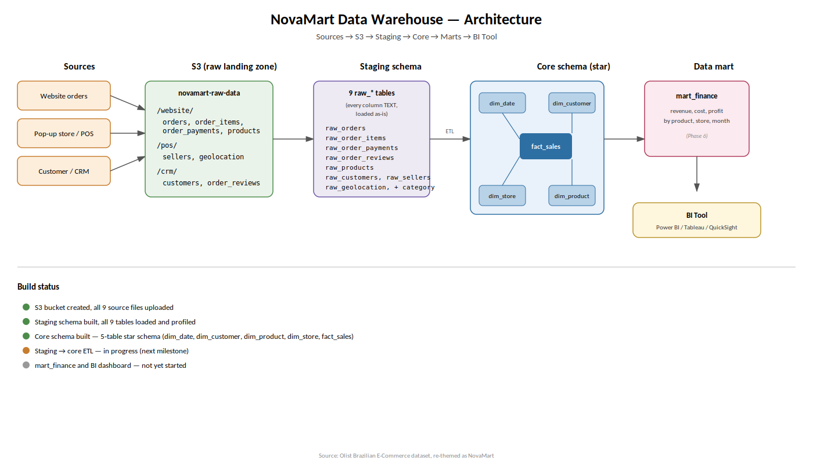

# NovaMart Data Warehouse

An end-to-end data warehouse built for a fictional multi-channel retailer, NovaMart, as a Data Warehousing group project (Chapters 1–4). Covers the full pipeline: raw data → cloud staging → integrated core warehouse → purpose-built data mart → BI dashboard.

**Team:**
- Moopeloa Jabulane — 22350028
- Asande Akhona Dlamini — 22367136
- Sibahle Magubane — 22271233
- Senamile Nxumalo — 22302052

---

## 1. Business Scenario

NovaMart sells home & lifestyle products through three channels: an e-commerce website, a mobile app, and pop-up stores in three cities. Leadership's problem: "Finance, marketing, and operations all report different sales numbers. Nobody can tell us, in one place, which products are profitable, which channel is growing, or how long it takes an order to ship."

This warehouse was built to answer that, starting with the **Sales** business process — the process leadership explicitly complained about, and the one with the most complete, reliable transaction-level data available.

## 2. Architecture



Three-layer design (Ch. 2):

- **staging** — raw, minimally-touched data, loaded exactly as it arrived from the source CSVs (same column names, same messy values). Kept **persistent** rather than truncated after each load, so we can always audit and re-derive core from the original raw form without re-uploading from S3.
- **core** — the integrated, cleaned single source of truth. One star schema for the Sales process, at the atomic grain (one row per order line).
- **mart_finance** — a narrower, purpose-built star scoped to Finance's stated need ("revenue, cost, and profit by product, store, and month"), plus a second fact table demonstrating a different fact table type.

Source data: the **Olist Brazilian E-Commerce Public Dataset** (Kaggle), re-themed as NovaMart data — Olist's "sellers" become NovaMart's pop-up stores, and the dataset's single e-commerce channel is documented as `channel = 'Website'` throughout (see Section 5, Known Limitations, in `dashboard/README.md`).

## 3. Dimensional Model

**Grain:** one row per order line — the finest detail the source data actually provides (Ch. 3 §3.3). See `docs/04_star_schema_erd.png` for the full ERD and `docs/data_dictionary.md` for every table/column/type/additivity classification.

- **Dimensions:** Dim_Date (role-playing, natural YYYYMMDD key), Dim_Customer, Dim_Product, Dim_Store
- **Facts (core.fact_sales):** quantity, price, freight_value, sales_amount, product_cost (estimated), profit — all additive; unit_price is non-additive and calculated on demand
- **Surrogate keys:** SERIAL integers on every dimension except Dim_Date; natural keys kept as reference columns, never used as join keys
- **Dummy-key strategy (Ch. 4 §2.4):** every fact row resolves to a real dimension row — unmatched foreign keys substitute `-1` ("Unknown") or `19000101` for dates, verified by an `INNER JOIN` from fact → every dimension returning the same row count as the fact table itself (112,650)

## 4. Data Quality

Full report in the project history; five real issues found and fixed during Phase 3, including empty-string dates that weren't true NULLs, 613 products with unresolved categories (fixed with `LEFT JOIN` + `COALESCE`), unstandardised lowercase city names, and a CSV-import tool bug that silently corrupted multi-line review text (traced, verified against the raw file, and fixed by regenerating the source CSV).

## 5. Data Mart & Secondary Fact Table

`mart_finance` rolls the atomic Sales grain up to product + store + month for fast BI queries. A second fact table, `order_fulfilment_snapshot`, was built as an **accumulating snapshot** — chosen over a periodic snapshot because the source data genuinely supports a four-stage order timeline (purchase → approved → shipped → delivered), while a channel-based periodic snapshot would carry almost no analytical value in this dataset (channel is constant). Full justification in `docs/05_fact_table_type_justification.md`.

No Year-to-Date or Month-to-Date column is stored anywhere in the warehouse (Ch. 4 §3) — these are calculated live in the BI tool.

## 6. Reporting Layer

Built in **AWS QuickSight**, connected live to `mart_finance`. Five visuals answering the dashboard's business questions, including a non-additive profit-margin ratio and a visual built on the accumulating snapshot. Full writeup, screenshots, and business-question mapping in `dashboard/README.md` (also delivered as `dashboard/README.pdf`).

## 7. How to Run This Project

1. **AWS setup:** create an S3 bucket for raw source files; provision an RDS PostgreSQL instance.
2. **Schemas:** run `sql/01_create_schemas.sql` to create `staging`, `core`, `mart_finance`.
3. **Load staging:** import the Olist CSVs into `staging` tables exactly as-is (DBeaver's import wizard, or `COPY`/`\copy` from S3).
4. **Core tables:** run `sql/02_create_core_tables.sql` to create the star schema DDL.
5. **ETL to core:** run `sql/03_etl_staging_to_core.sql` to populate and validate `core`.
6. **Build the mart:** run `sql/04_build_data_mart.sql` (DDL + ETL in one file) to populate `mart_finance`.
7. **Connect BI tool:** point AWS QuickSight (or Power BI / Tableau) at `mart_finance` and rebuild the dashboard described in `dashboard/README.md`.

## 8. Repository Structure

```
novamart-dwh-project/
├── README.md                          ← this file
├── docs/
│   ├── 02_architecture_diagram.png
│   ├── 04_star_schema_erd.png
│   ├── data_dictionary.md
│   └── 05_fact_table_type_justification.md
├── sql/
│   ├── 01_create_schemas.sql
│   ├── 02_create_core_tables.sql
│   ├── 03_etl_staging_to_core.sql
│   └── 04_build_data_mart.sql
├── dashboard/
│   ├── README.md
│   ├── README.pdf
│   └── screenshots/
└── NovaMart_Project_Summary.pdf       ← one-page CV/portfolio summary
```
